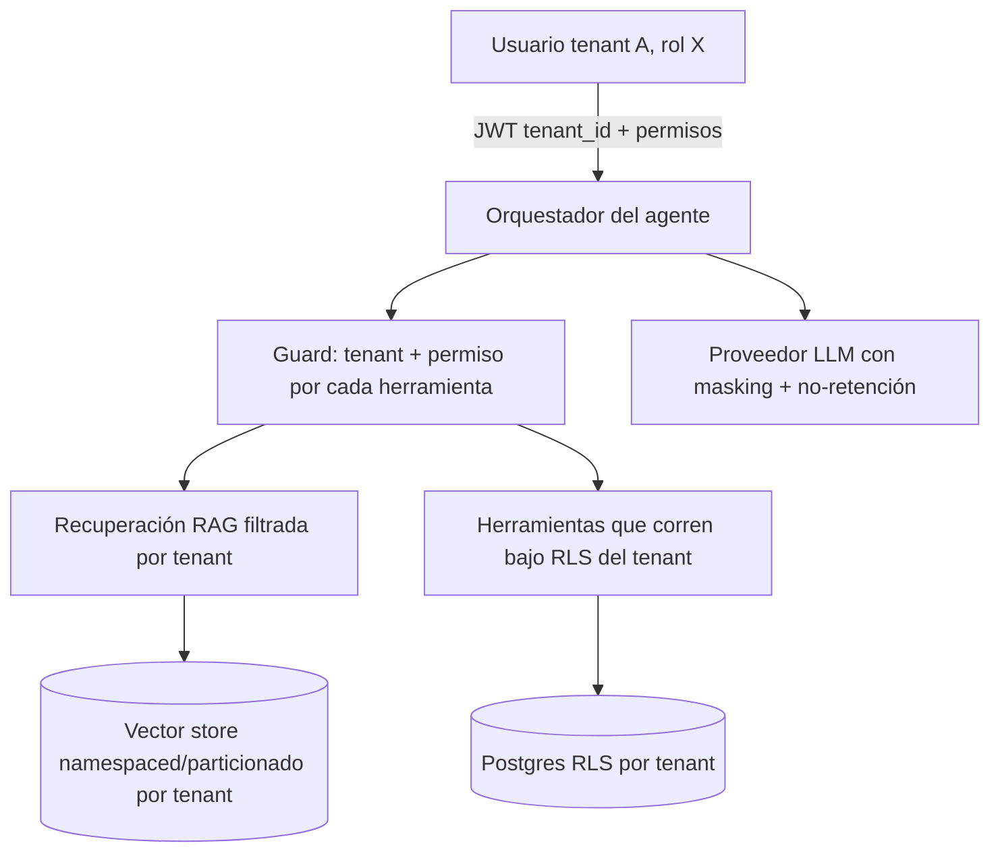

# AI_AGENT_ARCHITECTURE — Agente de IA multi-tenant (concepto)

> Cómo incorporar a futuro un "AI System Architect" u otros agentes **sin romper el aislamiento**. Diseño conceptual; **no se implementa el agente ahora**. Complementa [`../security/AI_SECURITY.md`](../security/AI_SECURITY.md).

## 1. Principio
Un agente que actúa para el Tenant A **jamás** accede a contexto del Tenant B: ni memoria, ni documentos, ni embeddings/vectores, ni conversaciones, ni herramientas, ni datos recuperados, ni prompts específicos de otro cliente.

## 2. Arquitectura

## 3. Aislamiento por componente
| Componente | Regla |
|---|---|
| **Memoria** (conversacional y larga) | por `(tenant_id, user_id)`; nunca global |
| **Documentos / embeddings / vectores** | metadato `tenant_id` obligatorio + filtro en toda búsqueda; **preferible namespace/índice físico por tenant** |
| **Conversaciones** | almacenadas por tenant; RLS |
| **Herramientas (tools)** | cada tool valida tenant + permiso antes de ejecutar; corre bajo RLS del usuario |
| **Datos recuperados** | solo del tenant activo; jamás mezclar en el contexto |
| **Prompts propietarios** | server-side; no se envían al cliente |
| **Baja de tenant** | purga de memoria/vectores/documentos del tenant |

## 4. Qué sale (o no) a proveedores externos de IA
- **No** enviar: datos de otro tenant, secretos, recetas/costos sin consentimiento, PII innecesaria.
- **Masking/redacción** de PII y secretos antes de llamar al LLM.
- Contrato con **no-entrenamiento** y retención mínima; considerar despliegue privado para datos ultra-sensibles.
- Registrar qué se envió a qué proveedor (trazabilidad).

## 5. Amenazas específicas
- **Prompt injection** desde datos del cliente → el agente trata todo dato como no confiable; no obedece instrucciones embebidas.
- **Exfiltración cross-tenant** por tool mal filtrada → guard obligatorio por tool.
- **Fuga por logs** → sin PII/secretos en claro.

## 6. Requisito de habilitación
Antes de conectar el agente a datos reales: **tests de aislamiento del agente** (A no recupera nada de B por ningún canal) + revisión de egress a proveedores. Es una fase posterior (ROADMAP Phase 9+), después de que el aislamiento multi-tenant esté probado.
