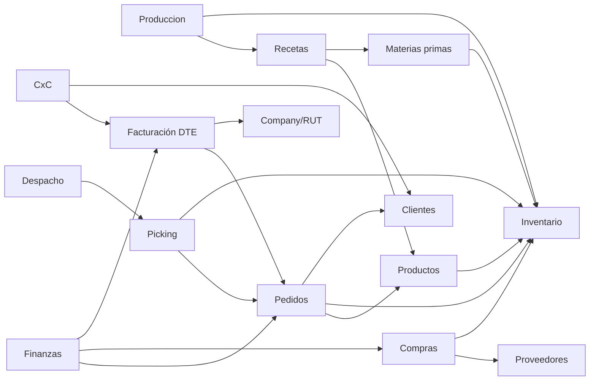

# MODULE_ARCHITECTURE — Arquitectura modular

> Cada tenant activa solo los módulos que necesita (feature flags en `tenant_modules`). Clasificación y dependencias.

## 1. Clasificación

### CORE (siempre activos — base de la plataforma)
- **Dashboard**, **Usuarios/RBAC**, **Configuración**, **Auditoría**, **Productos**, **Inventario/Bodegas/Movimientos**.
> Sin estos no hay plataforma. Todo tenant los tiene.

### OPTIONAL (activables según industria)
- **Materias primas**, **Recetas**, **Producción** (fábricas/cocinas).
- **Compras/Proveedores** (abastecimiento).
- **Ventas/Pedidos/Clientes/Comercial**, **Portal mayorista**, **Listas de precio**.
- **Picking**, **Despacho**, **Portal chofer**.
- **Finanzas** (Caja, CxC, CxP, Estado de resultados, Costos), **Conciliación bancaria**.
- **Mantención**, **Limpieza**.
- **RRHH/Asistencia**.
- **Campañas/Email marketing**, **Alertas**, **Reportes**.

### ENTERPRISE (avanzados / mayor complejidad o costo)
- **Facturación electrónica (DTE)**.
- **Integration Hub avanzado** (bancos, POS, ecommerce, GPS).
- **Multi-company** (varias razones sociales por tenant).
- **Agente de IA**.
- **Observabilidad avanzada / SLA**.

## 2. Perfiles por industria (plantillas de activación)

| Industria | Módulos típicos activos |
|---|---|
| **Fábrica de alimentos** | CORE + Materias primas, Recetas, Producción, Compras, Ventas, Portal mayorista, Picking, Despacho, Finanzas, Mantención, Limpieza |
| **Restaurante** | CORE + Recetas, Producción (cocina), Compras, Caja, Inventario, Limpieza |
| **Cafetería** | CORE + Compras, Caja, Inventario, (Recetas simples) |
| **Dark kitchen** | CORE + Recetas, Producción, Pedidos, Despacho, Integraciones ecommerce |
| **Distribuidora** | CORE + Ventas, Pedidos, Portal mayorista, Picking, Despacho, Finanzas (CxC), Rutas |
| **Pequeño fabricante** | CORE + Materias primas, Recetas, Producción, Compras |

> Estas plantillas son **datos** (ver CONFIGURATION_ENGINE), no código.

## 3. Dependencias entre módulos

**Reglas de dependencia (validadas al activar/desactivar):**
- Recetas requiere Productos (+ Materias primas para insumos).
- Producción requiere Recetas + Inventario.
- Pedidos requiere Productos + Inventario (+ Clientes).
- Picking→Despacho requieren Pedidos.
- Facturación requiere Pedidos + Company con config tributaria.
- Finanzas/CxC se alimentan de Pedidos, Compras y Facturación.
- Desactivar un módulo con dependientes activos → **advertencia/bloqueo** (no dejar dependientes huérfanos).

## 4. Cómo se implementa el "activar módulo"
- `tenant_modules(tenant_id, module_key, enabled)`.
- **UI:** el menú y las rutas se renderizan según módulos activos + permisos.
- **API:** cada endpoint declara su `module_key`; un guard `requireModule(module_key)` responde 404/403 si el módulo no está activo para el tenant (además del permiso).
- **Datos:** desactivar un módulo **no borra** sus datos (se conservan; se ocultan).

## 5. Relación con el código actual
La mayoría de módulos **ya existen** (system/MODULES). El trabajo es: (a) agregar `tenant_id`, (b) envolver con `requireModule` + `requirePermission`, (c) mover diferencias a configuración. No se reescriben los módulos.
