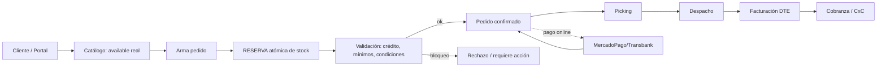

# ORDER_FLOW — Pedidos y portal de clientes

> Flujo end-to-end, multi-tenant, apoyado en el inventario (INVENTORY_ARCHITECTURE).

## 1. Flujo principal

## 2. Etapas y reglas

| Etapa | Reglas / validaciones |
|---|---|
| **Catálogo** | muestra solo `available` por marca/tenant; precios según lista del cliente |
| **Pedido** | valida mínimos de compra, múltiplos, productos activos |
| **Reserva** | reserva atómica anti-overselling (INVENTORY §4); expira si no se confirma/paga |
| **Validación comercial** | **crédito**: bloqueo por deuda vencida o sobre límite (regla configurable); condiciones del cliente |
| **Confirmación** | pago online (MercadoPago/Transbank) o transferencia/crédito según método |
| **Picking** | lista por pedido/ruta; confirma ítems; ajusta reserva |
| **Despacho** | descuenta stock (on_hand↓); notifica "en ruta"; captura evidencia/firma |
| **Facturación** | emite DTE con la company/RUT del tenant (BILLING_INTEGRATION) |
| **Cobranza** | genera CxC; seguimiento de pago; concilia |

## 3. Clientes mayoristas: capacidades
- **Listas de precio** por segmento y **precios personalizados** por cliente.
- **Mínimos de compra**, **descuentos**, **condiciones comerciales**.
- **Crédito**: límite, días, **bloqueo por deuda** (reutiliza `credit_rules`/`customer_credit_limits` con `tenant_id`).
- **Historial**, **documentos** (OC, factura, guía), **seguimiento** de estado y despacho.

## 4. Estados de pedido (configurables por tenant)
Base sugerida: `borrador → reservado → confirmado → en_picking → despachado → facturado → pagado` (+ `cancelado`). Los estados son **configurables** (CONFIGURATION_ENGINE) para adaptarse a cada industria.

## 5. Consistencia y seguridad
- Todo el flujo bajo `tenant_id` + RLS.
- **Idempotencia** en creación de pedido y en webhooks de pago (evita duplicados).
- **Nunca** confiar en el `tenant_id`/precio enviados por el cliente: precios y disponibilidad se recalculan server-side.
- **Auditoría** de cada transición de estado (quién, cuándo, antes/después).

## 6. Reutilización de hoy
Existe el flujo mayorista (portal, pedidos, pago MP/transferencia, correos, OC). El diseño lo **generaliza** (multi-tenant, listas de precio, reserva atómica, crédito configurable) sin reescribirlo. El "cancelado falso" minorista (security/KNOWN_ISSUES KI-6) se resuelve con estados propios y webhooks idempotentes, no espejando WooCommerce.
