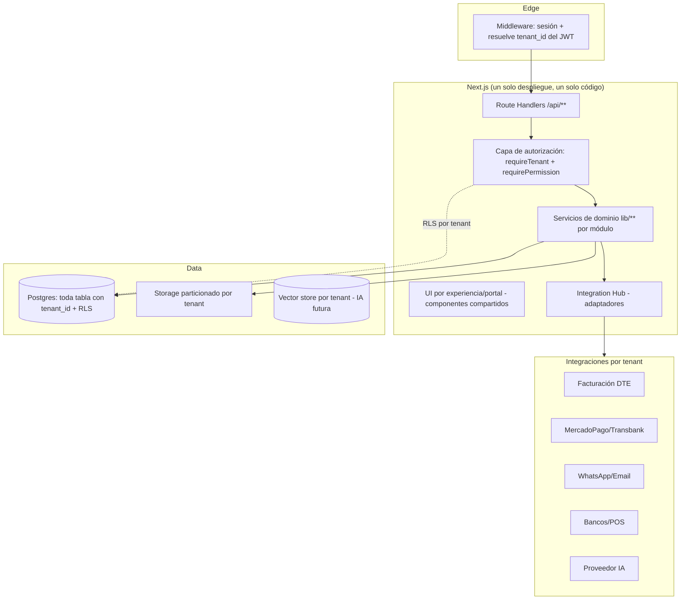

# SAAS_ARCHITECTURE — Arquitectura objetivo

> Diseño de la plataforma multi-tenant. Consume [`system/`](../system/SYSTEM_MASTER.md) y [`security/`](../security/SECURITY_AUDIT.md).

## 1. Principios
1. **Tenant es la raíz de aislamiento.** Todo dato operacional pertenece explícitamente a un tenant.
2. **El backend es la autoridad.** El `tenant_id` se deriva del **token de sesión (JWT)**, jamás de un campo enviado por el frontend. El cliente no puede elegir su tenant.
3. **Defensa en profundidad:** (a) `tenant_id` en cada tabla, (b) **RLS** que filtra por el tenant del JWT, (c) chequeo de permiso en la capa de aplicación, (d) tests de aislamiento.
4. **Configuración sobre código:** las diferencias entre empresas son **datos** (ver CONFIGURATION_ENGINE), no ramas de código.
5. **Módulos activables** por tenant (feature flags).
6. **Mínimo privilegio:** reducir el uso de service-role; operar con la sesión del usuario + RLS siempre que se pueda.

## 2. Vista de capas objetivo

## 3. Resolución de tenant (contrato de seguridad)
- Al iniciar sesión, el usuario recibe un JWT con `tenant_id` (y `roles`) en **`app_metadata`** (no editable por el cliente).
- **Middleware** valida sesión y expone `tenant_id` al request context.
- **Toda consulta** corre bajo RLS `WHERE tenant_id = auth.jwt()->>'tenant_id'`.
- **Ningún endpoint** acepta `tenant_id` desde el body/query como fuente de autoridad.
- Usuarios que pertenecen a **varios tenants** (p.ej. una consultora) → seleccionan tenant activo → se re-emite el JWT con ese tenant. El backend valida la membresía en `tenant_users`.

## 4. Mecanismos anti-fuga (mapeo a requerimientos)
| Riesgo | Mecanismo |
|---|---|
| Cross-tenant read/write | `tenant_id` + RLS + JWT como única fuente |
| IDOR (`/x/[id]`) | RLS filtra por tenant; además owner/branch check en la capa de servicio |
| Modificar `tenant_id` | columna **no escribible por el cliente**; se setea server-side; RLS impide `UPDATE` cross-tenant |
| Consultas sin filtro | RLS lo impone aunque el dev olvide el `WHERE`; lint/test que prohíbe service-role sin scope |
| Export/reportes cross-tenant | los generadores corren bajo RLS del tenant activo |
| Archivos cross-tenant | rutas con `tenant_id` + URLs firmadas (ver STORAGE_ARCHITECTURE) |
| Caché compartida | claves de caché **namespaced por tenant**; nada sensible en caché global |
| Búsqueda cross-tenant | el índice de búsqueda filtra por tenant (o índice por tenant) |

## 5. Estándares transversales
- **Autorización central:** helper `requirePermission(req, 'modulo.accion', {branch?})` reemplaza los arrays de rol copiados (system/ROLES_PERMISSIONS).
- **Validación:** `zod` en todos los endpoints (entrada tipada, anti mass-assignment).
- **Auditoría:** toda acción crítica escribe en el audit log central (ver §11 del pedido y OBSERVABILITY).
- **Idempotencia** en webhooks e integraciones (INTEGRATION_HUB).
- **Errores** que no revelan infraestructura (mensajes genéricos al cliente, detalle en logs).

## 6. Qué se conserva del sistema actual
- Stack (Next.js + Supabase), RLS ya presente en 68 tablas (base para el modelo), lógica de negocio rica y probada, portales existentes. La transformación es **evolutiva**, no reescritura (ver MIGRATION_PLAN).
