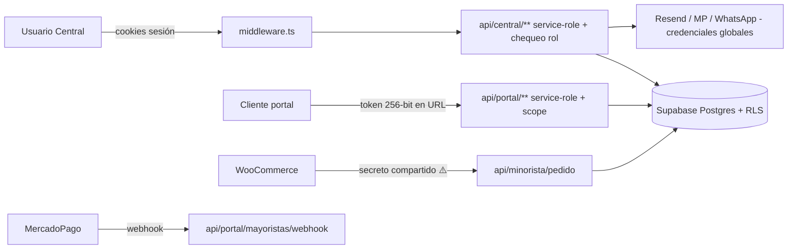

# SECURITY_ARCHITECTURE — Arquitectura de seguridad e infraestructura

> Verificado en `middleware.ts`, `lib/supabase/*`, `.env.example`, `next.config.mjs`, `.gitignore`.

## 1. Superficie y confianza

**Fronteras de confianza:** navegador (no confiable) → middleware (solo sesión) → route handlers (autorizan) → Supabase (RLS, pero sorteada por service-role).

## 2. Autenticación

- **Proveedor:** Supabase Auth. Hashing de contraseñas y emisión de **JWT** gestionados por Supabase (no implementado a mano). ✅
- **Sesión Central:** cookies (`@supabase/ssr`), validadas y refrescadas en `middleware.ts` con `auth.getUser()`.
- **Portales:** (a) **token opaco** (`gen_random_bytes(32)` hex, 256-bit) en la URL; (b) login dedicado (chofer/operario/aldea).
- **Reset de contraseña:** token propio **sha256, un solo uso, con expiración** (`set-password`) — robusto y desacoplado del magic link.
- **MFA/2FA:** ❌ no existe. **Sin segundo factor para administradores** (SEC-08).
- **Política de contraseñas:** mínimo 6 caracteres, sin requisitos de complejidad. Débil.
- **Expiración/rotación de sesión:** valores por defecto de Supabase (`NO VERIFICADO` si se ajustaron).

## 3. Autorización
- **Modelo:** rol string en `profiles.role`, validado con **arrays de roles** repetidos en cada endpoint (ver system/ROLES_PERMISSIONS). No hay RBAC central ni mínimo privilegio a nivel de datos (service-role).
- **Portales:** autorización = posesión del token (o login) + scope por `mayorista_id`/dueño.

## 4. Gestión de secretos
- Secretos en **variables de entorno** (Vercel), fuera del repo. ✅
- **Excepciones:** un secreto de webhook **hardcodeado** (SEC-02) y datos bancarios en código (config de empresa).
- **Solo** las variables `NEXT_PUBLIC_*` llegan al navegador (anon key, MP public key, GA, maps) — todas de exposición aceptable. El **service-role NO** tiene ese prefijo → no se filtra al cliente. ✅

## 5. Infraestructura / Deployment (parcial — `REQUIERE CONFIRMACIÓN`)

| Aspecto | Estado |
|---|---|
| Hosting | **Vercel** (inferido; sin `vercel.json`) |
| Base de datos / Auth / Storage | **Supabase** (gestionado: TLS, cifrado en reposo, backups gestionados) |
| CDN / SSL-TLS | Vercel (HTTPS automático) — `NO VERIFICADO` config de headers/CSP |
| DNS / dominios | nommafood.cl (+ mayoristas.brotesasiaticos.cl declarado) |
| CI/CD | ❌ no hay `.github/workflows` en el repo |
| Ambientes DEV/STAGING/PROD | ❌ no declarados → **riesgo de usar datos reales en dev/pruebas** (`REQUIERE CONFIRMACIÓN`) |
| Monitoring / logging / alertas | ❌ no verificado (Vercel/Supabase básicos por defecto) |
| Rate limiting / WAF | ❌ ninguno |
| Headers de seguridad (CSP, HSTS, X-Frame) | `NO VERIFICADO` (no hay config en `next.config.mjs`) |
| Source maps de producción | ❌ deshabilitados (default Next; `productionBrowserSourceMaps` no activado) ✅ |

## 6. Riesgos de infraestructura
- **Sin separación de ambientes** confirmada → un error en dev puede tocar datos productivos. Definir DEV/STAGING/PROD antes de sumar clientes.
- **Sin CI/CD** → despliegues manuales sin gates de seguridad (typecheck/lint/test/secret-scan).
- **Sin monitoreo/alertas** → un incidente puede pasar inadvertido.

## 7. Recomendaciones base (no ejecutar aún)
- Ambientes separados + datos sintéticos en dev.
- Headers de seguridad (CSP, HSTS, X-Frame-Options, Referrer-Policy) vía `next.config`/middleware.
- CI con typecheck + lint + **secret scanning** + build.
- Centralizar autorización (`requireRole`) y reducir service-role.
