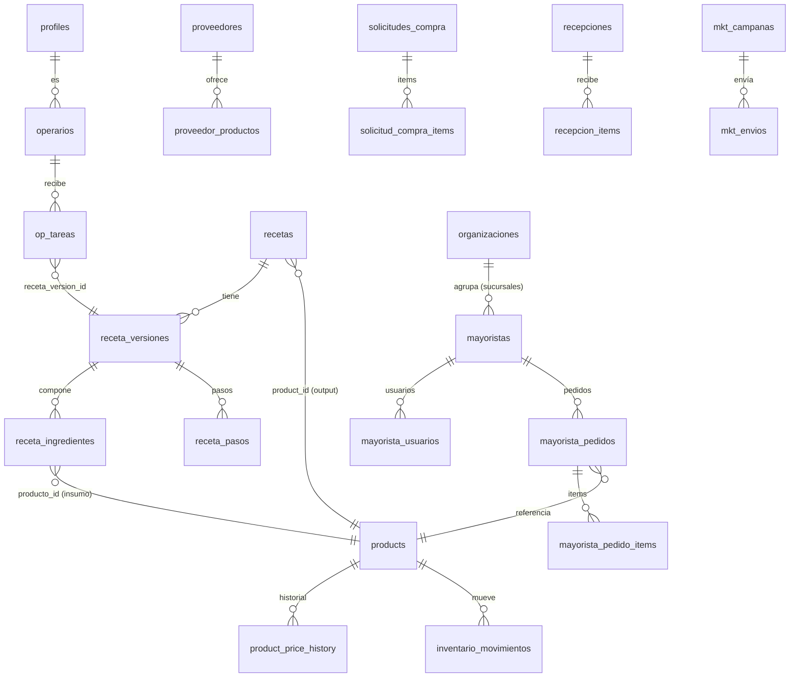

# DATABASE_SCHEMA — Mapa de datos

> Fuente: 48 scripts en `supabase/*.sql` (≈97 `CREATE TABLE`, ≈93 tablas únicas).
> ⚠️ **No hay framework de migraciones.** Los scripts se aplicaron **manualmente** en el dashboard de Supabase. **La BD real puede diferir del repo** → cualquier afirmación de esquema es `REQUIERE CONFIRMACIÓN` contra la BD viva.

## 1. Dominios de datos (agrupación)

| Dominio | Tablas principales (vivas) | Legacy/duplicadas (uso 0 en código) |
|---|---|---|
| **Identidad/acceso** | `profiles`, `operarios`, `mayorista_usuarios`, `organizaciones` | `operators` (⚠️ **también en uso**) |
| **Catálogo/producto** | `products`, `product_price_history`, `product_audit_log`, `catalogos` | — |
| **Recetas/producción** | `recetas`, `receta_versiones`, `receta_ingredientes`, `receta_pasos`, `receta_audit_log`, `op_produccion_pasos` | `recipes`, `recipe_ingredients`, `recipe_steps`, `production_orders`, `production_items` |
| **Inventario** | `inventario_lotes`, `inventario_movimientos`, `bodegas` | `inventory_movements`, `inventory_catalog_items`, `warehouse_locations`, `stock_reservations` |
| **Compras/proveedores** | `proveedores`, `proveedor_productos`, `proveedor_precio_historial`, `solicitudes_compra`, `solicitud_compra_items`, `recepciones`, `recepcion_items` | `supplier_products`, `supplier_price_history`, `purchase_orders`, `purchase_requests`, `purchase_receipts` |
| **Pedidos B2B (mayorista)** | `mayorista_pedidos`, `mayorista_pedido_items` | `orders`, `order_lines` |
| **Pedidos minorista** | `minorista_pedidos`, `minorista_pedido_items` | — |
| **Operación/tareas** | `op_tareas`, `op_jornadas`, `op_tarea_cierre`, `op_tarea_eventos`, `op_asistencia`, `op_turnos`, `op_mensajes`, `op_checklist_templates` | `adt_tasks` (uso bajo), `picking_tasks` (uso bajo), `task_reports`, `task_validations`, `task_evidence_files` |
| **Logística/despacho** | `dispatches` | — |
| **Limpieza/mantención** | `cleaning_reports`, `maintenance_events`, `machine_failures` | — |
| **Finanzas** | `fin_movimientos`, `fin_cierres_caja`, `fin_cartolas`, `fin_cartola_movimientos`, `balance_snapshots`, `customer_receivables`, `customer_credit_limits`, `credit_rules` | `cash_entries`, `payments` |
| **Marketing/CRM** | `mkt_campanas`, `mkt_envios`, `mkt_plantillas`, `mkt_cupones` | `marketing_campaigns`, `marketing_customers`, `campaign_templates`, `campaign_deliveries`, `customers` |
| **Aldea (cliente)** | `aldea_catalogo`, `aldea_stock`, `aldea_solicitudes`, `aldea_solicitud_items`, `aldea_facturas`, `aldea_incidencias`, `aldea_reserva` | — |
| **Config/plataforma** | `business_settings`, `landing_config`, `geovictoria_config` | — |
| **Auditoría/eventos** | `audit_logs`, `notificaciones`, `payment_webhook_events`, `access_requests`, `access_request_events`, `web_visits`, `import_requests` | — |

**Evidencia de uso (conteo `from('tabla')` en `app/`+`lib/`):**
`mayorista_pedidos`=31 · `mkt_campanas`=14 · `operators`=10 · `recetas`=10 · `op_tareas`=8 · `proveedor_productos`=7 · `solicitudes_compra`=7 · `operarios`=5 · `inventario_movimientos`=4 · `adt_tasks`=3 · `picking_tasks`=1 · **`recipes`=0 · `orders`=0 · `supplier_products`=0 · `inventory_movements`=0 · `purchase_requests`=0 · `production_orders`=0 · `customers`=0 · `marketing_campaigns`=0**.

## 2. Hallazgos críticos para el producto

1. **Doble esquema (español vivo / inglés muerto).** El sistema empezó con un scaffold en inglés y migró a tablas en español. El inglés quedó como **peso muerto** (0 usos). Riesgo: confunde a devs/IA y a la BD real. → Limpiar (ver [`TECH_DEBT.md`](./TECH_DEBT.md)).
2. **Duplicación VIVA `operarios` vs `operators`.** Ambas se usan en código → posible bug de datos partidos. `REQUIERE CONFIRMACIÓN` de cuál es la buena.
3. **Sin columna de tenant** en las tablas núcleo (`products`, `recetas`, `operarios`, `proveedores`, `inventario_*`, `fin_*`, `mkt_*`). Solo `organizacion_id` en `mayoristas`, `mayorista_usuarios`, `aldea_*` (y modela clientes, no tenants). → El sistema es **single-tenant** (ver [`SAAS_MIGRATION_PLAN.md`](./SAAS_MIGRATION_PLAN.md)).
4. **Config global singleton.** `landing_config` fuerza `id=1` (una sola landing/empresa). `business_settings` es key/value **global** (sin tenant). Datos NOMMA sembrados (`credit_rules`, `warehouse_locations`).
5. **RLS activo en ~68 tablas**, pero muchas escrituras van por **service-role** (ignora RLS). La correctitud de políticas **no auditada** → `REQUIERE CONFIRMACIÓN`.

## 3. ERD (núcleo vivo, simplificado)

> ⚠️ **Nota de FK duplicadas:** `recetas` tiene **más de una FK hacia `products`** (producto de salida + posibles insumos/otros). Los `embed` PostgREST deben **desambiguar** (`products!product_id`). Ver [`KNOWN_ISSUES.md`](./KNOWN_ISSUES.md).

## 4. Recomendación de mapa objetivo
Toda tabla de negocio debe colgar de un **`tenant_id` (empresa)**, y `organizaciones`/sucursales pasar a ser un nivel **dentro** del tenant. Detalle en [`SAAS_MIGRATION_PLAN.md`](./SAAS_MIGRATION_PLAN.md).
